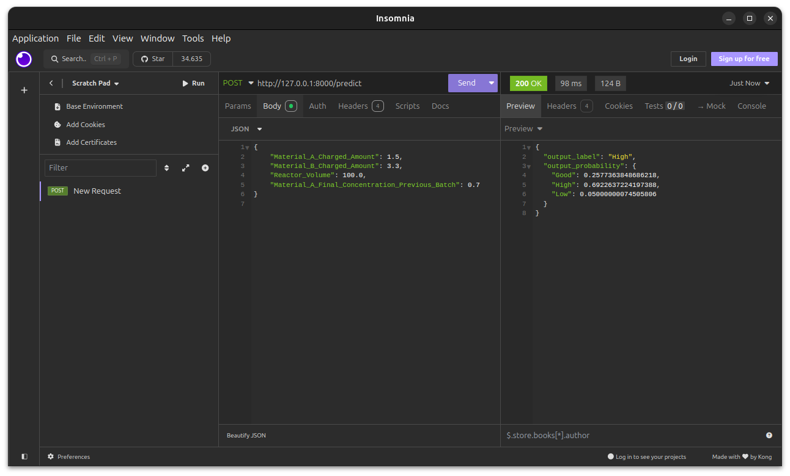

# ONNX Model API Deployment

This project demonstrates how to deploy an ONNX model as a REST API using FastAPI. The API exposes a single endpoint, `/predict`, which accepts a POST request with a JSON payload for generating predictions.

## Endpoint

### `/predict` (POST)

The `/predict` endpoint expects a JSON body with the following structure:

- `Material_A_Charged_Amount` (float): The charged amount of material A.
- `Material_B_Charged_Amount` (float): The charged amount of material B.
- `Reactor_Volume` (float): The volume of the reactor.
- `Material_A_Final_Concentration_Previous_Batch` (float): The final concentration of material A in the previous batch.

Example POST request:



## Running the Application

The application is containerized using Docker, making it easy to deploy.

### Steps to Deploy

1. Add the trained model to the models folder
   ```bash
   cp /path/to/your_model.onnx models/model.onnx
   ```

2. Build the Docker image:
   ```bash
   docker build -t onnx-model-api .
   ```

3. Run the Docker container:
   ```bash
   docker run -d -p 8000:8000 onnx-model-api
   ```

The API will be accessible at `http://127.0.0.1:8000`.

## Testing the API

You can test the API using tools like Postman, Insomnia, or curl. The default API documentation is available at [Swagger UI](http://127.0.0.1:8000/docs), where you can also interact with the `/predict` endpoint.

## Documentation

The project uses FastAPI's automatically generated documentation, which can be accessed at:
- **Swagger UI**: [http://127.0.0.1:8000/docs](http://127.0.0.1:8000/docs)
- **ReDoc**: [http://127.0.0.1:8000/redoc](http://127.0.0.1:8000/redoc)
